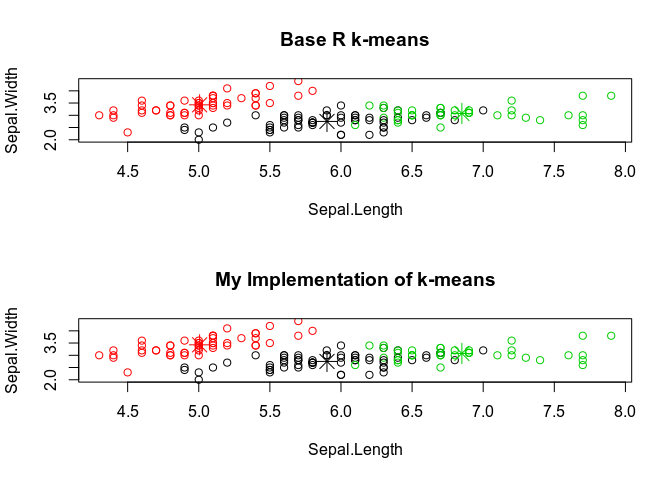

K-means From Scratch Demo
================

Implementing K-means from Scratch in R
--------------------------------------

#### by Tad Peterson

This is a short walk through of implementing the k-mean algorithm from scratch as implemented in [Kmeans\_from\_scratch.R](https://github.com/tadtenacious/MSDS/blob/master/Data_Mining/Kmeans_from_scratch.R) located in this repo. This was an assignment in a Data Mining class for my Master of Data Science program.

K-means is an unsupervised clustering algorithm. It begins by choosing a value for *K*, indicating the desired number of clusters. Once this value has been chosen, then *K* rows/points are randomly chosen within a matrix and are assigned as centroids or centers of a cluster. Then the [Euclidean Distance](https://en.wikipedia.org/wiki/Euclidean_distance) is calculated for each row to each centroid. This creates the distance matrix of *n* rows and *K* columns where each row consists of the distances to each centroid. Then for each row in the distance matrix, the minimum distance is used to assign the row to a cluster. Then within each cluster, or matrix subset, all of the rows are averaged together to create a new centroid. Then the Euclidean Distance calculation and cluster assignment process is repeated and compared with the previous cluster assignments until there is no difference (convergence) between cluster assignments or a predetermined number of iterations has been completed.

I chose to break down the task into a series of functions implementing linear algebra and minimizing the use of for loops as much as possible and so that it can run in *n* dimensions. As an added incentive, for loops in R are notoriously slow.

#### Calculate the Euclidean distance between a matrix and vector

Because a row is really a vector, we use linear algebra to calculate the distance between a vector and a matrix.

``` r
vec_dist <- function(matrix,vec) {
  ones <- rep(1,length(vec))
  dvec <- (t(t(matrix) - vec)^2 %*% ones)^(1/2)
  return(dvec)
}
```

#### Create the distance matrix

This way, the abstraction continues to build by calling the `vec_dist` function above for k centroids returning the distance matrix.

``` r
mat_dist <- function(matrix, centroids, K) {
  dist_mat <- matrix(nrow = nrow(matrix),ncol = nrow(centroids))
  for (ix in 1:K){
    cntr <- centroids[ix,]
    dvec <- vec_dist(matrix, cntr)
    dist_mat[,ix] <- dvec
  }
  return(dist_mat)
}
```

#### Calculate centroids

Next, the new centroids have to be calculated. Note that if there is only one point/row/vector, then there is only one member of that cluster. And because new centroids are defined as the average point within a cluster, clusters with one member do not require additional calculations.

``` r
calc_centroid <- function(mat.subset, old.centroid){
  if (class(mat.subset)!= "matrix"){
    return(old.centroid)
  }
  else{
    new.centroid <- as.vector((t(mat.subset) %*% rep(1,nrow(mat.subset))) / nrow(mat.subset))
    return(new.centroid)
  }
}
```

#### Put the above 3 steps together

The next function is how the algorithm is put together to get from one centroid to the next centroid. It calls the `dist_mat` function to create the distance matrix, assigns rows to clusters based on which one it is closest to, then it calculates the new centroids for the next iteration. The function returns an object that contains the new centriods, a vector of corresponding cluster labels, and a labeled matrix.

``` r
run_iteration <- function(matrix, centroids, K){
  dist_mat <- mat_dist(matrix, centroids, K) #Calculate Distance Matrix
  labs <- apply(dist_mat,1,FUN=which.min) #Arg Mins
  labeled.mat <- cbind(matrix,labs)
  new_centroids <- matrix(nrow = K, ncol = ncol(matrix))
  rownames(new_centroids) <- 1:K
  for (group in 1:K){
    lab.col <- ncol(labeled.mat)
    sset <- subset(labeled.mat,labeled.mat[,lab.col]==group)[,1:lab.col-1]
    new.cntr <- calc_centroid(sset,centroids[group,])
    new_centroids[group,] <- new.cntr
  }
  colnames(new_centroids) <- colnames(matrix)
  kmean.res <- structure(list(), class="kmeans.result")
  kmean.res$centroids <- new_centroids
  kmean.res$labels <- labs
  kmean.res$result <- labeled.mat
  return(kmean.res)
}
```

#### Write one last function to implement the missing parts of the algorithm

Still missing is to select *K* random points, iterate through the various calculations to find the new centriods and compare the results to the initial or prior runs. Once there are no changes (movement between clusters), the result is returned. However, in case it is taking to long for the centroids to converge, stop iterating at a predetermined threshold.

``` r
k.manual_means <- function(matrix, K, iterations=1000){
  first_centroids <- matrix[sample(nrow(matrix),K),]
  res <- run_iteration(matrix, first_centroids, K)
  for (i in 1:iterations){
    new_res <- run_iteration(matrix, res$centroids, K)
    if (identical(res$labels,new_res$labels)){
      return(res)
    }
    else{
      res <- new_res
    }
  }
  return(res)
}
```

Now we can test this implementation of k-means against the one in base R. The key to the comparison is trying to control the randomness as much as possible. The algorithm starts by selecting *K* random points. Hypothetically, if those points are the same between implementations, the results should be the same.

``` r
set.seed(101)
imat <- as.matrix(iris[,1:4])
my.k.means <- k.manual_means(imat,3)
table(iris$Species, my.k.means$labels)
```

    ##             
    ##               1  2  3
    ##   setosa      0 50  0
    ##   versicolor 48  0  2
    ##   virginica  14  0 36

``` r
set.seed(101) # reset seed to same seed
rkmeans <- kmeans(imat,3,1000) # same K and same iterations
table(iris$Species, rkmeans$cluster)
```

    ##             
    ##               1  2  3
    ##   setosa      0 50  0
    ##   versicolor 48  0  2
    ##   virginica  14  0 36



As the tables and plots show, the results are identical when running from the same random state and same max iterations.
